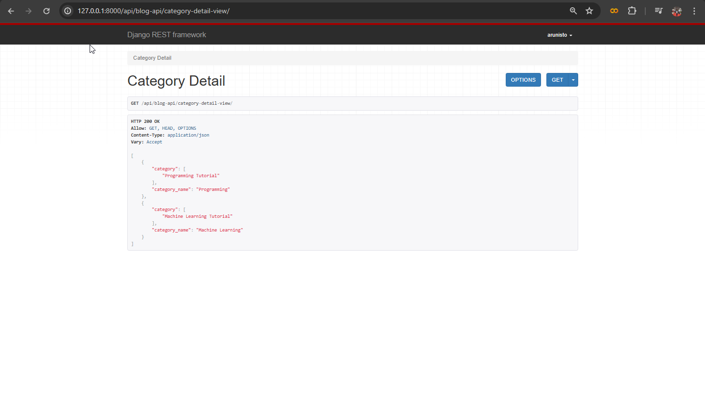

## 10.05.2024
### API Reference Continues
So, on our previous section we see that nested serializer concept that displaying the details of foreign key related table. And we can see that it fetching all the details but we don't want that. So, we are going to return the string that we provided on our `__str__` special method on our `models.py` file. For that we want to make some changes on our `serializer.py` file like below
```python
class CategorySerializer(serializers.ModelSerializer):
    #category_name = serializers.CharField()
    #category = BlogSerializer(many=True, read_only=True)

    #API Reference
    category = serializers.StringRelatedField(many=True)

    class Meta:
        model = Category
        exclude = ["id"]
```
You can clearly see that previous topics code that i comment down and added a new line with `serializers.StringRelatedField` after making these changes the output result will be look like below



We just saw that how the `StringRelatedField` works, next we're going to display the `PrimaryKeyRlatedField`
```python
class CategorySerializer(serializers.ModelSerializer):
    #category_name = serializers.CharField()
    #category = BlogSerializer(many=True, read_only=True)

    #API Reference
    #category = serializers.StringRelatedField(many=True)
    category = serializers.PrimaryKeyRelatedField(many=True, read_only=True)

    class Meta:
        model = Category
        exclude = ["id"]
```
This will display only the primary key, next, we're going to see the `HyperlinkedRelatedField` for this method you need to pass two arguments called `view_name` and `lookup_field`. After the implementation code will look like below
```python
class CategorySerializer(serializers.ModelSerializer):
    #category_name = serializers.CharField()
    #category = BlogSerializer(many=True, read_only=True)

    #API Reference
    #category = serializers.StringRelatedField(many=True)
    #category = serializers.PrimaryKeyRelatedField(many=True, read_only=True)
    category = serializers.HyperlinkedRelatedField(
        many=True,
        read_only=True, view_name='blog-list-view', lookup_field='id')

    class Meta:
        model = Category
        exclude = ["id"]
```
After make this change you need to add one more argument `context` at your `views.py`'s serialize_data object like below

```python
class CategoryDetailView(APIView):
    def get(self, request):
        data = Category.objects.all()
        serialized_data = CategorySerializer(data, many=True, context={'request': request})
        return Response(serialized_data.data, status=status.HTTP_200_OK)

class CategoryListView(APIView):
    def get(self, request, id):
        data = Category.objects.get(id=id)
        serialized_data = CategorySerializer(data, context={'request': request})
        return Response(serialized_data.data, status=status.HTTP_200_OK)
```
After making this change you will see a link of the data on your result. And next we're going to execute `SlugRelatedField`, like below
```python
class CategorySerializer(serializers.ModelSerializer):
    #category_name = serializers.CharField()
    #category = BlogSerializer(many=True, read_only=True)

    #API Reference
    #category = serializers.StringRelatedField(many=True)
    #category = serializers.PrimaryKeyRelatedField(many=True, read_only=True)
    """category = serializers.HyperlinkedRelatedField(
        many=True,
        read_only=True, view_name='blog-list-view', lookup_field='id')"""
    category = serializers.SlugRelatedField(many=True, read_only=True, slug_field='slug')

    class Meta:
        model = Category
        exclude = ["id"]
```
