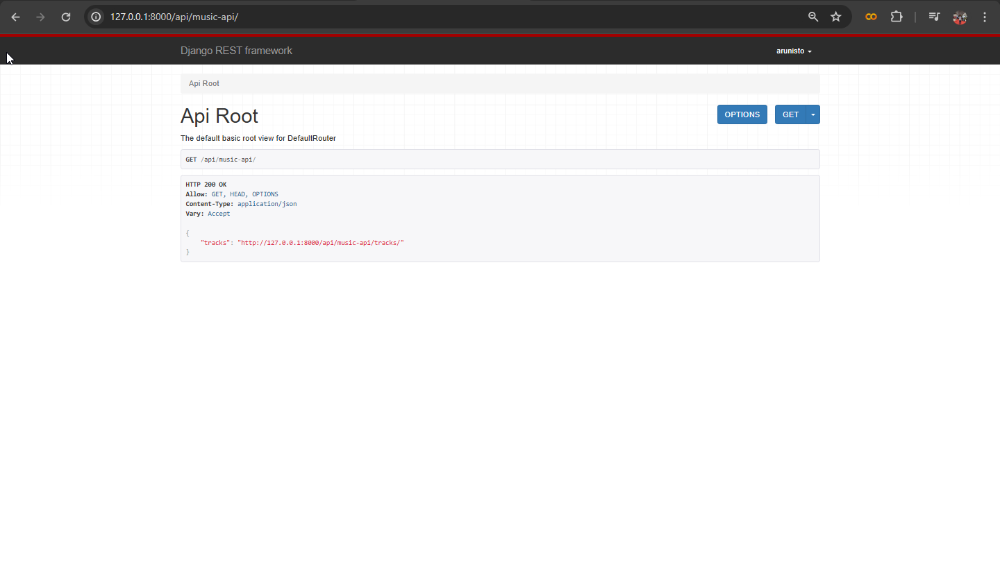
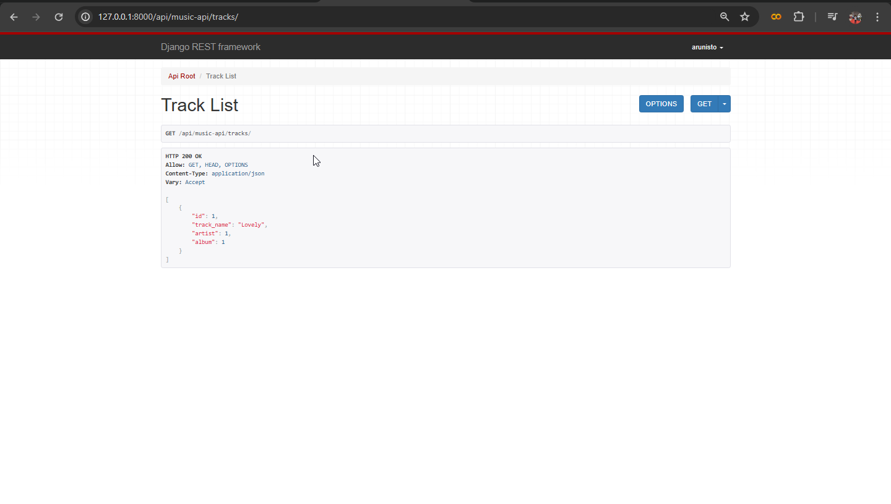
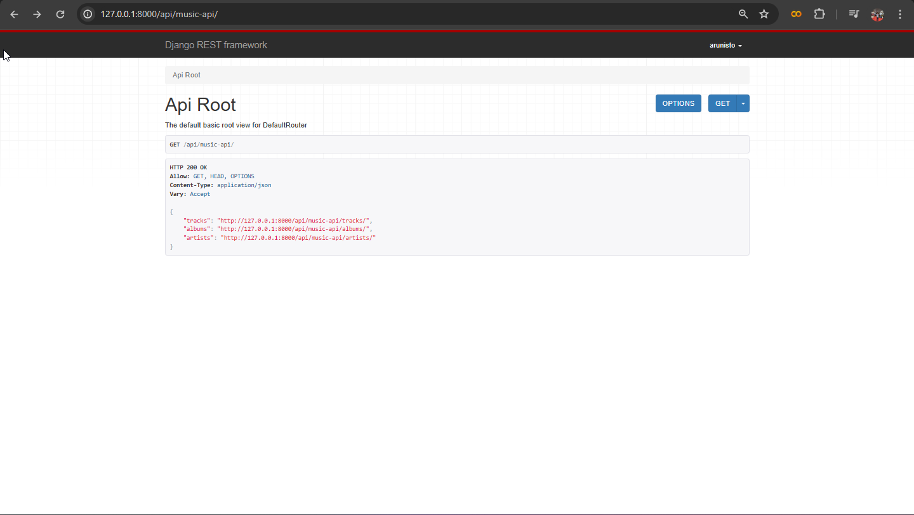

There's two `viewsets` in `rest_framework` one is `viewset` and other one is `modelviewset` first we're going to see the `viewset` for that first you need to import the `viewsets` from `rest_framework` like below

```python
from rest_framework import viewsets
```
Then you need to inherit the `viewsets` in your view class, like below
```python
from rest_framework import viewsets
from rest_framework.response import Response
from .models import *
from .serializer import *

class TrackViewSet(viewsets.ViewSet):
    def list(self, request):
        queryset = Track.objects.all()
        serialized_data = TrackSerializer(queryset, many=True)
        return Response(serialized_data.data)
```
In the above code we used `list` method for `get` method this method will fetch all the instance in model. And after creating your views you need to register your viewset on your `urls.py` file, like below
```python
from django.urls import path, include
from rest_framework import routers
from .views import *

router = routers.DefaultRouter()
router.register(r'tracks', viewset=TrackViewSet, basename="tracks")

urlpatterns = [
    path('', include(router.urls))
]
```
In the above code the `r'tracks'` is your endpoint and already on my project folder `urls.py` file i included my app url as given below
```python
from django.contrib import admin
from django.urls import path, include

urlpatterns = [
    path('admin/', admin.site.urls),
    path('api/music-api/', include('MusicAPI.urls')),
]
```
so now our url will be look like `http://<host:port>/api/music-api/tracks` but you dont need to worry because on our app folder `urls.py` file we include our router urls in a blank url so if you goes to  `http://<host:port>/api/music-api/` the result will look like below



On the above result you can see that showing an link so, simply you can click the link it will navigate you to the page of your views like below



on the same above method i created viewsets for my 3 models, and the result is look like below



If your using viewsets you dont need to write a view for fetching a single instance the viewset class automatically handles it you just need to add one method on your class called `retrieve`, but you need to import some packages like below

```python
from django.shortcuts import get_object_or_404
```
Then you can simply write your method like below
```python
from rest_framework import viewsets
from rest_framework.response import Response
from django.shortcuts import get_object_or_404
from .models import *
from .serializer import *

# Create your views here.
class TrackViewSet(viewsets.ViewSet):
    def list(self, request):
        queryset = Track.objects.all()
        serialized_data = TrackSerializer(queryset, many=True)
        return Response(serialized_data.data)

    def retrieve(self, request, pk=None):
        queryset = Track.objects.all()
        track = get_object_or_404(queryset, pk=pk)
        serialized_data = TrackSerializer(track)
        return Response(serialized_data.data)
```
The above retrieve method will help us to fetch a single instance from our model you dont need add anything on your `urls.py` file the viewsets automatically handles it.

Next we're going to see how to implement `post` method on our viewset for that you need to use the `create` method on your viewset class like below

```python
class TrackViewSet(viewsets.ViewSet):
    def list(self, request):
        queryset = Track.objects.all()
        serialized_data = TrackSerializer(queryset, many=True)
        return Response(serialized_data.data)

    def retrieve(self, request, pk=None):
        queryset = Track.objects.all()
        track = get_object_or_404(queryset, pk=pk)
        serialized_data = TrackSerializer(track)
        return Response(serialized_data.data)

    #creare
    def create(self, request):
        serialized_data = TrackSerializer(data=request.data)
        if serialized_data.is_valid():
            serialized_data.save()
            return Response(serialized_data.data, status=status.HTTP_201_CREATED)
        return Response(serialized_data.errors, status=status.HTTP_400_BAD_REQUEST)
```

The above `create` method help us to create instance in our model


Next we're going to look into `update` method. It's also same as create function but this method need to fetch data using some key, like below

```python
class TrackViewSet(viewsets.ViewSet):
    def list(self, request):
        queryset = Track.objects.all()
        serialized_data = TrackSerializer(queryset, many=True)
        return Response(serialized_data.data)

    def retrieve(self, request, pk=None):
        queryset = Track.objects.all()
        track = get_object_or_404(queryset, pk=pk)
        serialized_data = TrackSerializer(track)
        return Response(serialized_data.data)

    #creare
    def create(self, request):
        serialized_data = TrackSerializer(data=request.data)
        if serialized_data.is_valid():
            serialized_data.save()
            return Response(serialized_data.data, status=status.HTTP_201_CREATED)
        return Response(serialized_data.errors, status=status.HTTP_400_BAD_REQUEST)

    def update(self, request, pk=None):
        track = get_object_or_404(Track, pk=pk)
        serialized_data = TrackSerializer(track, data=request.data)
        if serialized_data.is_valid():
            serialized_data.save()
            return Response(serialized_data.data)
        return Response(serialized_data.errors)
```

The last one of this viewset `delete` that's our next section. for this we need to create a method called `destroy` like below

```python
class TrackViewSet(viewsets.ViewSet):
    def list(self, request):
        queryset = Track.objects.all()
        serialized_data = TrackSerializer(queryset, many=True)
        return Response(serialized_data.data)

    def retrieve(self, request, pk=None):
        queryset = Track.objects.all()
        track = get_object_or_404(queryset, pk=pk)
        serialized_data = TrackSerializer(track)
        return Response(serialized_data.data)

    #creare
    def create(self, request):
        serialized_data = TrackSerializer(data=request.data)
        if serialized_data.is_valid():
            serialized_data.save()
            return Response(serialized_data.data, status=status.HTTP_201_CREATED)
        return Response(serialized_data.errors, status=status.HTTP_400_BAD_REQUEST)

    def update(self, request, pk=None):
        track = get_object_or_404(Track, pk=pk)
        serialized_data = TrackSerializer(track, data=request.data)
        if serialized_data.is_valid():
            serialized_data.save()
            return Response(serialized_data.data)
        return Response(serialized_data.errors)

    def destroy(self, request, pk=None):
        track = get_object_or_404(Track, pk=pk)
        track.delete()
        return Response({"message":"Deleted Successfully"})
```

### ModelViewSet
Actually, ModelViewSet is a predefined class you dont need to write so much code like above for each method separately because `ModelViewSet` is come with predefined methods, so you just need to write only the below code

```python
class TrackModelView(viewsets.ModelViewSet):
    queryset = Track.objects.all()
    serializer_class = TrackSerializer
```
That's it the above 3 lines of code will do every methods that we write separately on our previous section. and always remember `queryset` and `serializer_class` is default parameters

