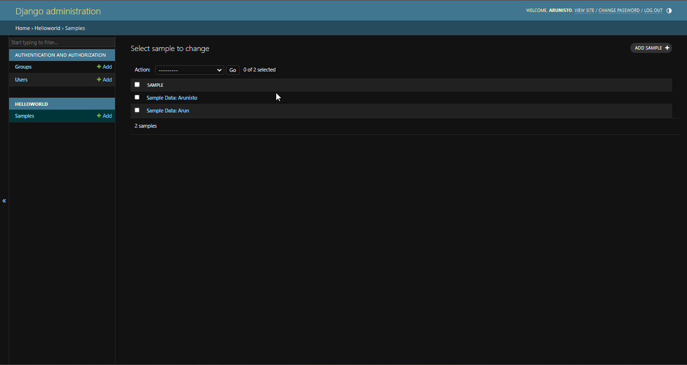
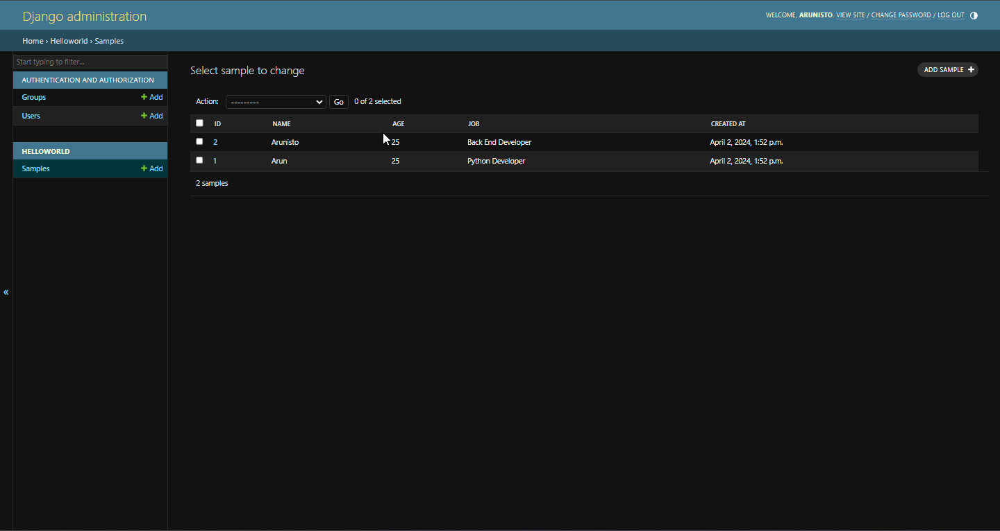
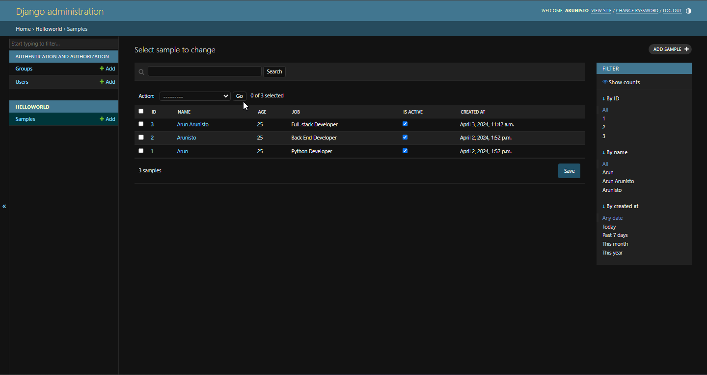
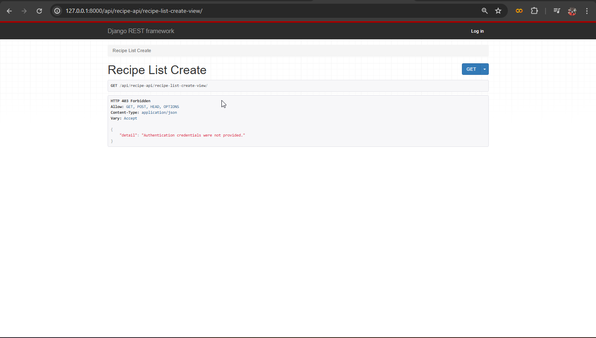
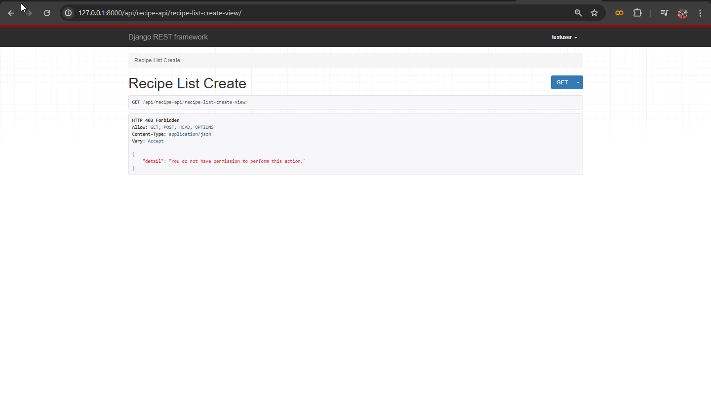

# Django-Rest-Framework-API-Tutorials

## API's using DRF
### Tech Stacks
Install the following required packages/modules using pip
```commandline
pip install django djangorestframework
```
After the packages installing successfully, use the below command to create project
```commandline
django-admin startproject drf_api_project_folder .
```
The above code will create a project folder named `drf_api_project_folder`. I am going to create two applications `1. mainApp` and `2. helloWorld` by using the below command
### 1. mainApp
```commandline
python manage.py startapp mainApp
```
### 2. helloWorld
```commandline
python manage.py startapp helloWorld
```
Okay, so let's move into the next section, after successfully create apps, need to add into `INSTALLED_APPS` on `settings.py` file in the project folder.
```python
#settings.py
INSTALLED_APPS = [
    'django.contrib.admin',
    'django.contrib.auth',
    'django.contrib.contenttypes',
    'django.contrib.sessions',
    'django.contrib.messages',
    'django.contrib.staticfiles',
    'rest_framework',
    'helloWorld',
    'mainApp'
]
```
## mainApp
`mainApp` will navigate the user about the end-points and other operations
## helloWorld
`helloWorld` app just an application to demonstrate the basic api operations
On the day ```02.04.2024``` on hello world app we create a sample model and other sample views to display data on JSON format

## 03.04.2024 - ADMIN PANEL CONFIGURING
1. Changing Dash Board View

Changing the admin dashboard view from this



to this



by adding the code block on `admin.py` on your app folder, adding a new class in `admin.py` file like below

```python
class SampleAdmin(admin.ModelAdmin):
     list_display = ("id", "name", "age", "job", "created_at") #these names are the column names of our model
```

After adding the class you need to register on your admin site like below

```python
admin.site.register(Sample) #previous one only with model
```
the above code needs to change to like below
```python
admin.site.register(Sample, SampleAdmin)
```

2. Adding Links

Now you can view the data from dashboard and if you click the `id` it will navigate to the edit page, but if we need to do the same when we click other field like `name` to do that we are going to add an another attribute named `list_display_links` inside the class like below
```python
class SampleAdmin(admin.ModelAdmin):
    list_display = ("id", "name", "age", "job", "created_at")
    list_display_links = ("id", "name")
```

3. Search Links

We can add search field using the same method, add a line of code like below
```python
class SampleAdmin(admin.ModelAdmin):
    list_display = ("id", "name", "age", "job", "created_at")
    list_display_links = ("id", "name")
    search_fields = ("name", "job")
```
Always remember you need to provide column names on tuple always

4. Pagination

We can add pagination feature on our dashboard you can limit the table list per page, by adding the below line of code
```python
class SampleAdmin(admin.ModelAdmin):
    list_display = ("id", "name", "age", "job", "created_at")
    list_display_links = ("id", "name")
    search_fields = ("name", "job")
    list_per_page = 10
```

5. Editing

We can implement the editing feature (without navigate to detail view) also, before that i am going to add an another boolean field on our model like below
```python
class Sample(models.Model):
    name = models.CharField(max_length=100)
    age = models.IntegerField(default=0)
    job = models.CharField(max_length=100, null=True)
    is_active = models.BooleanField(default=True) #<--- Added field
    created_at = models.DateTimeField(default=datetime.now())
```
After the column added we need to run the scripts for `makemigrations` and `migrate` on our command prompt. After the migration we are going to add the `is_active` column for editable columns, like below
```python
class SampleAdmin(admin.ModelAdmin):
    list_display = ("id", "name", "age", "job", "is_active", "created_at")
    list_display_links = ("id", "name")
    search_fields = ("name", "job")
    list_per_page = 10
    list_editable = ('is_active',)
```

6. Filter

Next we're going to add the filter option by using `list_filter` like below

```python
class SampleAdmin(admin.ModelAdmin):
    list_display = ("id", "name", "age", "job", "is_active", "created_at")
    list_display_links = ("id", "name")
    search_fields = ("name", "job")
    list_per_page = 10
    list_editable = ('is_active',)
    list_filter = ("id", "name", "created_at")
```

After all these changes your admin dashboard will look like this



<hr>

# Rest API

In the above part we just created a simple API using django's default json concept. But this is not the proper way to create an API we need some architecture or rules to follow for creating an API that's where the `djangorestframework` aka `drf` is going to use for that we are going to create a new app named `employeeDetails` for doing some CRUD operations on employee field using REST API, so first we're going to create an app using below command on terminal

```commandline
python manage.py startapp employeeDetails
```

After successfully created i had done the admin panel styling parts like above and created models you can check that out, that's all for today we will start to create REST API from tomorrow:

Refer `employeeDetails/README.md` for the code and explanation of the topics that covered on the app.

Topics:

- Serializers
- Function-Based Views - GET, POST, PUT, and DELETE
- Status Codes

## 10.04.2024
### Model Serializer
For demonstrating `ModelSerializer` we're going to create another app called `StudentDetails`

For the code and explanation goto `StudentDetails/README.md`

## 11.04.2024
### Class Based Views
For that we're going to create an app called `TodoApp` and this app views will be completely using the class based views

For the code and explanation refer `TodoApp/README.md`

Topics:

- Class Based Views - GET. PUT, POST, and DELETE

## 19.04.2024
### Validation
Next we're going to see how to validate the serialized fields for that we're going to create an application named `votersDetails`, and we are going to use class based views and model serailizers for the application.

For code and explanation refer `votersDetails/README.md`.

Topics:
- Field-level Validation
- Object-level Validation
- Serializer Method Field

### Nested Serializer
For this topic we're going to create an new application called `spotifyApp` with 2 tables `Tracks` and `Albums` here, i will show you the `Foregin-key` concept also and other configurations all are same.

For code and explanation refer `spotifyApp/README.md`

Topics:
- Foreign Key
- Nested Serializer

### API Reference
For this topic we're going to create a new Application named `BlogApp`, because this topic covers various concept like serialization on `StringRelatedField`, `HyperLink`, `SlugField`, etc so, we're going to create a new app and going to add lots of columns in our models, like below

```python
import random
import string
from django.db import models
from django.template.defaultfilters import slugify

# Create your models here.
class Category(models.Model):
    category_name = models.CharField(max_length=50)

    def __str__(self):
        return f"Category: {self.category_name}"

class Blog(models.Model):
    blog_title = models.CharField(max_length=100)
    blog_description = models.TextField()
    category = models.ForeignKey(Category, on_delete=models.CASCADE, related_name="category")
    post_date = models.DateTimeField(auto_now_add=True)
    is_public = models.BooleanField(default=True)
    slug = models.CharField(max_length=1000, null=True, blank=True)

    def __str__(self):
        return self.blog_title

    def save(self, *args, **kwargs):
        if not self.slug:
            base_slug = slugify(self.blog_title+" "+self.category.category_name)
            self.slug = base_slug+''.join(random.choice(string.ascii_letters+string.digits) for _ in range(5))
        return super().save(*args, **kwargs)
```

Then as usual add views, urls, serializers like we before did.

For code / explanatons refer `BlogApp/README.md`.

Topics:
- API Reference

## 14.05.2024
### Generic View - Mixins
We saw how the Class based views works in our previous parts. From today onwards we're going to look into how the `Generic View` works! Comparing to other views Generic view is easy and it's only need a short code we dont need junk line of codes. For this `Generic View` initialization we're going to create a new app called `booksApp` so we will continue this topic after all the other configuration of app's finish! I will be right back after sometime!! Happy Coding!!

For code and explanation refer `booksApp/README.md`

Topics:
- Generics
- Mixins

## 20.05.2024
### Concrete View Classes
Today we're going to discuss about the `ConcreteViewClasses` for this! I am going to create a new `application` called `MovieReviewApp`, by using the above methods

For code and explanation refer `MovieReviewApp/README.md`.

Topics:
- generics views

### ViewSet
The next topic is view sets for this topic i am going to create a new application called `MusicAPI` so we can use the application for reference.

For code and explanation refer `MusicAPI/README.md`

Topics:
- Viewsets

## 22.05.2024
### How to Create Views In Django - For Single and Multiple Instance - DRF
For this tutorial i am going to create a new app called `RecipeApp`.

For code and explanation refer `RecipeApp/README.md`

Topics:
- generics views

## 23.05.24
### Permissions
There two level of permission in django-rest-framework

1. Global Level Permission
2. Object Level Permission

And also there's 4 type of permissions in drf

1. AllowAny
2. IsAuthenticated
3. IsAdminUser
4. IsAuthenticatedOrReadOnly

And also you can set your `CustomPermissions` also.

### IsAuthenticated
First, we're going to look into `IsAuthenticated` as global level for that you just need to add the permission on your projects `settings.py` file it will then it will affect all your applications as well.

Actually, `IsAuthenticated` means you need to login when you need to access anything so if you're not then not able to do anything.

## 24.05.24
For the above `IsAuthenticated` activate as global level in you're project first you need to open `settings.py` file and scroll down to the bottom of the file the copy paste the below code in your file
```python
REST_FRAMEWORK = {
    'DEFAULT_PERMISSION_CLASSES': [
        'rest_framework.permissions.IsAuthenticated',
    ]
}
```
The above provided code will help you globally your project to login if you want to do some operations. So, if you're not login the result will look like below



And you need to provide the credentials to access the contents of your applications in your entire project.

### Object Level Permission
So, next we're going to create `object-level permission` before that we're going to comment down the `global-level permission` otherwise it will override that's not a good practise!

if you're using class-based views on your applications you need to specify the `permission_classes` on your class. Or, if you're using function-based views you need to import the decorators from your `rest_framework.permissions` module. Actually, here we're using class based views so we're going to use the `permission_classes` on our class, but before that you need to import some classes from `rest_framework.permissions` module. like below

```python
from rest_framework.response import Response
from rest_framework import status
from rest_framework import generics
from .models import *
from .serializer import *
from rest_framework.permissions import IsAuthenticated

class RecipeListCreateView(generics.ListCreateAPIView):
    queryset = Recipe.objects.all()
    serializer_class = RecipeSerializer
    permission_classes = [IsAuthenticated]
```

After i made the above change in my `RecipeApp` i can access every other applications views without login. But for `RecipeApp` i need to Authorise before trying to do any changes!!

This is how the `IsAuthenticated` method will work in `Class Based Views`, We will check out how this is going to work in `Function Based Views` for that we're going to select the function-based application `employeeDetails` that we create in previous section. For function based views we're going to use the decorator like below.
```python
from .models import Employee
from .serializer import EmployeeSerializer
from rest_framework.response import Response
from rest_framework.decorators import api_view, permission_classes
from rest_framework import status
from rest_framework.permissions import IsAuthenticated
# Create your views here.
@api_view(['GET', 'POST']) #this decorator only used when we use function based views
@permission_classes([IsAuthenticated])
def employee_list(request):
    if request.method == "POST":
        serializer = EmployeeSerializer(data=request.data)
        if serializer.is_valid():
            serializer.save()
            return Response(serializer.data, status=status.HTTP_201_CREATED)
        else:
            return Response(serializer.errors, status=status.HTTP_400_BAD_REQUEST)
    all_emp = Employee.objects.all()
    #converting to json using serializer
    serialized_data = EmployeeSerializer(all_emp, many=True) #if we are fetching more than one data we need to add many=True
    return Response(serialized_data.data, status=status.HTTP_200_OK) #status code 200
```
In the above code first we import the decorator `permission_classes` from the `rest_frmework.decorators` module and then we import the `IsAuthenticated` from `rest_framework.permissions` module. This how the Authenticating permission implement in `Function Based Views`

Next we're going to look into `IsAdminUser` this method is all about the permissions only allowed for `Admin` users if you give this in your `permission_classes` the view will only allowed to the `Admin Users` first we will implement this in a `Class Based Views` for that we're going to use the application `RecipeApp`

```python
from rest_framework.response import Response
from rest_framework import status
from rest_framework import generics
from .models import *
from .serializer import *
from rest_framework.permissions import IsAuthenticated, IsAdminUser

class RecipeListCreateView(generics.ListCreateAPIView):
    queryset = Recipe.objects.all()
    serializer_class = RecipeSerializer
    #permission_classes = [IsAuthenticated]
    permission_classes = [IsAdminUser]
```
After the implementation of `IsAdminUser` if you try to access the content using other login credentials the result will be look like below



And you're only able to access the contents if you logged in as a admin!!

Let's look into `Function Based Views` also for that we're going to take the `employeeDetails` application!

```python
from .models import Employee
from .serializer import EmployeeSerializer
from rest_framework.response import Response
from rest_framework.decorators import api_view, permission_classes
from rest_framework import status
from rest_framework.permissions import IsAuthenticated, IsAdminUser
# Create your views here.
@api_view(['GET', 'POST']) #this decorator only used when we use function based views
@permission_classes([IsAdminUser])
def employee_list(request):
    if request.method == "POST":
        serializer = EmployeeSerializer(data=request.data)
        if serializer.is_valid():
            serializer.save()
            return Response(serializer.data, status=status.HTTP_201_CREATED)
        else:
            return Response(serializer.errors, status=status.HTTP_400_BAD_REQUEST)
    all_emp = Employee.objects.all()
    #converting to json using serializer
    serialized_data = EmployeeSerializer(all_emp, many=True) #if we are fetching more than one data we need to add many=True
    return Response(serialized_data.data, status=status.HTTP_200_OK) #status code 200
```

Next we're going to look into `IsAuthenticatedOrReadOnly` permissions. This permission will allow users to view `(GET)` the content without login but if they try to write `(POST)` something they need to login. For this method we're going to use the `booksApp`
```python
from rest_framework.response import Response
from rest_framework import status
from rest_framework.views import APIView
from .models import Author, Category, Book
from .serializer import AuthorSerializer, CategorySerializer, BookSerializer
from rest_framework import mixins, generics
from rest_framework.permissions import IsAuthenticatedOrReadOnly

# Create your views here.
#Generic Views
class BookListGenericView(mixins.ListModelMixin, mixins.CreateModelMixin, generics.GenericAPIView):
    queryset = Book.objects.all()
    serializer_class = BookSerializer
    permission_classes = [IsAuthenticatedOrReadOnly]

    #get method
    def get(self, request, *args, **kwargs):
        return self.list(request, *args, **kwargs)

    #post method
    def post(self, request, *args, **kwargs):
        return self.create(request, *args, **kwargs)
```
The above code you can view the contents without login but you need to login when you want to do the post method.

### Custom Permissions
Our next topic is `Custom Permissions` we're going to create our own custom permissions, for that we're going to build an app called `LbraryApp` here librarian will be the admin and the user is who comes to read the books and we're going to build this app as `Function Based View` app.

For code and explanation refer `LbraryApp/README.md`

## 17.06.2024
### Advanced Methods
This section is mainly focused for the advanced methods that developers used in their backend projects and we will discuss the function based and class based views here. Then also we will cover the advanced methods in serializers and models also. The application to demonstrate this section is `advancedMethods`.

For code and explanations refer `advancedMethods/README.md`

Topics:
- Login Form
- Decorators
- Uploading a File
- Downloading a File
- Sending Email
## 03.07.2024
- Added Decorators to class based views
- Decorators for a specific method
## 09.07.2024
- Changing Timezones
Cron Jobs & Worker
- Adding a cron job using "django-crontab"
  To install the package use the below command:

  ```CommandPrompt
  pip install django-crontab
  ```
  You can find the documentation about usage goto `advancedMethods` `README.md` file.

## 11.07.2024
- Using `celery` and `celery-worker` for scheduling a task
- Installing `redis-server` and configuring with `django`
- Using `flower` for  monitoring `celery`

