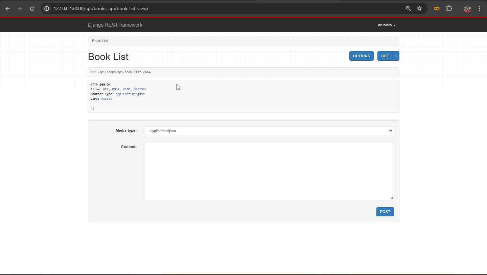
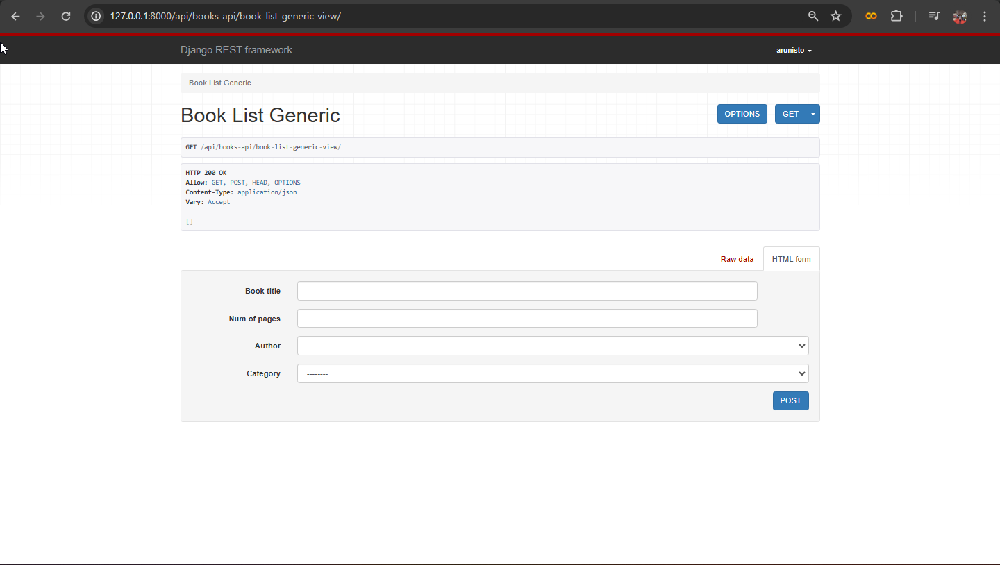

The above picture shows that how the normal class based views look like, but here we're not going to use the normal class based view. We're going to use the `Generic Views` like below

But before that you need to know about the attributes (default) for generic views. There are lots of attributes there so it's a default attr you're not allowed to change their names. So, first we are going to look into two generic view mixins

1. ListModelMixin
2. CreateModelMixin

Before you start you need to import the `mixins` and `generics` from `rest_framework` like below
```python
from rest_framework import mixins, generics
```
After the import, we're able to use the methods inside our code, So, the code for `Generic Views` will be look like below.
```python
from rest_framework.response import Response
from rest_framework import status
from rest_framework.views import APIView
from .models import Author, Category, Book
from .serializer import AuthorSerializer, CategorySerializer, BookSerializer
from rest_framework import mixins, generics

# Create your views here.
#Generic Views
class BookListGenericView(mixins.ListModelMixin, mixins.CreateModelMixin, generics.GenericAPIView):
    queryset = Book.objects.all()
    serializer_class = BookSerializer

    #get method
    def get(self, request, *args, **kwargs):
        return self.list(request, *args, **kwargs)

    #post method
    def post(self, request, *args, **kwargs):
        return self.create(request, *args, **kwargs)

```
On the above code you will see `queryset` and `serializer_class` objects, actually these are the default attribute I mentioned in previous part.

1. `queryset` - on this attribute you only allowed to write query otherwise it will raise an error
2. `serializer_class` - on this attribute you only allowed to write the serializer class without `()` these parenthesis. otherwise it will raise an error

Actually you can see that how many lines we just needed for the list view operations(GET, POST) this is one of the main reason for the `Generic View` use. And the other reason is after running the code just navigate to the url the result will be look like below



Previous parts you need to post data as in a JSON format but after the implementation of `Generic View` you are able to add data using a form. Now we're going to add this for other `Author` and `Category` models like above.

## 16.05.2024
### RetrieveModelMixin
On the above tutorial we've been look into fetch all the data using `ListModelMixin` here I am going to show you guys how to fetch a single data using `RetrieveModelMixin`.

```python
class BookDetailGenericView(mixins.RetrieveModelMixin, generics.GenericAPIView):
    queryset = Book.objects.all()
    serializer_class = BookSerializer

    def get(self, request, *args, **kwargs):
        return self.retrieve(request, *args, **kwargs)
```
On the above code we're returning `retrieve` instead of `list` because we're trying to fetch a single data, and yu can see that i didn't provide any keys to fetch data. Because you don't need to the `RetrieveModelMixin` will automatically takes the key as argument from `urls.py` and the url file remains same as the old applications urls file. And also dont worry i am providing the urls.py code below for a reference.

```python
from django.urls import path
from .views import *

urlpatterns = [
    path('book-list-view/', BookListView.as_view(), name="book-list-view"),
    path('book-list-generic-view/', BookListGenericView.as_view(), name="book-list-generic-view"),
    path('author-list-generic-view/', AuthorListGenericView.as_view(), name='author-list-generic-view'),
    path('category-list-generic-view/', CategoryListGenericView.as_view(), name="category-list-generic-view"),
    path('book-detail-generic-view/<int:pk>/', BookDetailGenericView.as_view(), name='book-detail-generic-view')
]
```
And i am going to add the feature to the remaining two models `Category` and `Author` like above

### UpdateModelMixin
`UpdateModelMixin` is used to update a particular data. For this, you don't need to create a new class you can simply add it on you're retrieve class that we created above you can add the update model mixin to the same class like below

```python
class BookDetailGenericView(mixins.RetrieveModelMixin, mixins.UpdateModelMixin, generics.GenericAPIView):
    queryset = Book.objects.all()
    serializer_class = BookSerializer

    def get(self, request, *args, **kwargs):
        return self.retrieve(request, *args, **kwargs)
    def put(self, request, *args, **kwargs):
        return self.update(request, *args, **kwargs)
```
That's it that's all!!! <3

### DestroyModelMixin
`DestroyModelMixin` is used to delete an element, for this also you dont need to create a separate class you can simply add to your existing class like `UpdateModelMixin` still confused don't worry i will provide the code below.

```python
class BookDetailGenericView(mixins.RetrieveModelMixin, mixins.UpdateModelMixin, mixins.DestroyModelMixin, generics.GenericAPIView):
    queryset = Book.objects.all()
    serializer_class = BookSerializer

    def get(self, request, *args, **kwargs):
        return self.retrieve(request, *args, **kwargs)
    def put(self, request, *args, **kwargs):
        return self.update(request, *args, **kwargs)
    def delete(self, request, *args, **kwargs):
        return self.destroy(request, *args, **kwargs)
```
In the above mixins we're using `pk` to retrieve data but how to use another field instead of `pk` (primary key) that's where we're going to use `lookup_field` for set a particular field from our model to fetch data. Here, we're going to use the `book_title` field for fetching data, always remember if the field doesn't exist on your model it will raise an error.

```python
class BookDetailGenericView(mixins.RetrieveModelMixin, mixins.UpdateModelMixin, mixins.DestroyModelMixin, generics.GenericAPIView):
    queryset = Book.objects.all()
    serializer_class = BookSerializer
    lookup_field = "book_title"

    def get(self, request, *args, **kwargs):
        return self.retrieve(request, *args, **kwargs)
    def put(self, request, *args, **kwargs):
        return self.update(request, *args, **kwargs)
    def delete(self, request, *args, **kwargs):
        return self.destroy(request, *args, **kwargs)
```

And also you need to make a change on your `urls.py` file also, like below:

```python
from django.urls import path
from .views import *

urlpatterns = [
    path('book-list-view/', BookListView.as_view(), name="book-list-view"),
    path('book-list-generic-view/', BookListGenericView.as_view(), name="book-list-generic-view"),
    path('author-list-generic-view/', AuthorListGenericView.as_view(), name='author-list-generic-view'),
    path('category-list-generic-view/', CategoryListGenericView.as_view(), name="category-list-generic-view"),
    path('book-detail-generic-view/<str:book_title>/', BookDetailGenericView.as_view(), name='book-detail-generic-view'),
    path('author-detail-generic-view/<int:pk>/', AuthorDetailGenericView.as_view(), name='author-detail-generic-view'),
    path('category-detail-generic-view/<int:pk>/', CategoryDetailGenericView.as_view(), name='category-detail-generic-view')
]
```
On the above code you can see that i changed `<int:pk>` to `<str:book_title>`!!
