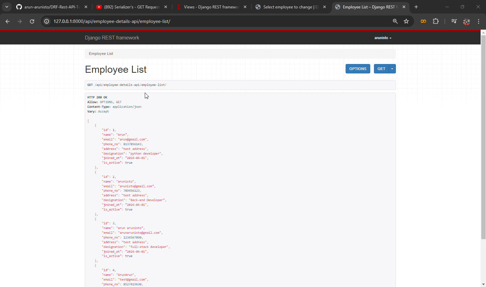

## 09.04.2024
REST API continues
<br>
After create an app you need to create a `serializer.py` file on your `app_folder`. Why we're using serializer?
<br>
Serializer - will help to convert complex datatypes into JSON format.
<br>
So after creating we need to add `serializers` to our program like below all the fields representing the fields in `models.py`. And there are two serializers one is `Serializer` other one is `ModelSerializer`, here we're using `Serializer`
```python
#serializer
from rest_framework import serializers

#creating serializers based on models field
class EmployeeSerializer(serializers.Serializer):
    id = serializers.IntegerField(read_only=True)
    name = serializers.CharField()
    email = serializers.EmailField()
    phone_no = serializers.IntegerField()
    address = serializers.CharField()
    designation = serializers.CharField()
    joined_at = serializers.DateField()
    is_active = serializers.BooleanField()
```
We can clearly seen that all the field taken from the `models.py` `Employee` class, and `TextField` is `CharField` in serializer
<br>
After successfully implemented the code on `serializer`, we're moving to the `views.py` to write views for our application.
### Function-Based Views - GET
Before that clear all the default code on you're `views.py` file and add the below provided code
```python
from .models import Employee
from .serializer import EmployeeSerializer
from rest_framework.response import Response
from rest_framework.decorators import api_view

# Create your views here.
@api_view(['GET'])
def employee_list(request):
    all_emp = Employee.objects.all()
    #converting to json using serializer
    serialized_data = EmployeeSerializer(all_emp, many=True)
    return Response(serialized_data.data)
```
`api_view` - In django rest framework `@api_view` decorator needs to be used if you're using function based views
`many=True` - If you want to fetch more than one data you need to pass this on args, otherwise, it will raise an error

After successfully created the views add your views to the `urls.py` then run the program and navigate to the url that provided by you here, and if you're running this repo the url will be like `http://127.0.0.1:8000/api/employee-details-api/employee-list/` navigate to this url using your browser the result will be look like below



Next, the code for fetching single data
```python
@api_view(["GET"])
def employee_details(request, id):
    emp = Employee.objects.get(id=id)
    serialized_data = EmployeeSerializer(emp)
    return Response(serialized_data.data)
```
Here you can clearly see that `many=True` is removed because we're fetching single data
### Function-Based views - POST
Before adding POST request you need to add a instance method called create on your `serializer` class like below
```python
class EmployeeSerializer(serializers.Serializer):
    id = serializers.IntegerField(read_only=True)
    name = serializers.CharField()
    email = serializers.EmailField()
    phone_no = serializers.IntegerField()
    address = serializers.CharField()
    designation = serializers.CharField()
    joined_at = serializers.DateField()
    is_active = serializers.BooleanField()

    def create(self, validated_data): #<--- this method added for the post request
        return Employee.objects.create(**validated_data)
```
POST request for adding data, we're going to add a request method post to our `employee_details` view like below
```python
@api_view(['GET', 'POST'])
def employee_list(request):
    if request.method == "POST":
        serializer = EmployeeSerializer(data=request.data)
        if serializer.is_valid():
            serializer.save()
            return Response(serializer.data)
        else:
            return Response(serializer.errors)
    all_emp = Employee.objects.all()
    #converting to json using serializer
    serialized_data = EmployeeSerializer(all_emp, many=True)
    return Response(serialized_data.data)
```
For api-testing i am using `postman` tool. You can use your own comfort tool/browser(drf-default config)
### Function-Based Views - PUT
For put method also we need to define a function called update on `serializer` like below
```python
class EmployeeSerializer(serializers.Serializer):
    id = serializers.IntegerField(read_only=True)
    name = serializers.CharField()
    email = serializers.EmailField()
    phone_no = serializers.IntegerField()
    address = serializers.CharField()
    designation = serializers.CharField()
    joined_at = serializers.DateField()
    is_active = serializers.BooleanField()

    #post request
    def create(self, validated_data):
        return Employee.objects.create(**validated_data)

    #put request
    def update(self, instance, validated_data):
        instance.name = validated_data.get('name', instance.name)
        instance.email = validated_data.get('email', instance.email)
        instance.phone_no = validated_data.get('phone_no', instance.phone_no)
        instance.address = validated_data.get('address', instance.address)
        instance.designation = validated_data.get('designation', instance.designation)
        instance.joined_at = validated_data.get('joined_at', instance.joined_at)
        instance.is_active = validated_data.get('is_active', instance.is_active)
        instance.save()
        return instance
```
And we're going to add view for PUT method
```python
@api_view(["GET", "PUT"])
def employee_details(request, id):
    if request.method == "PUT":
        emp = Employee.objects.get(id=id)
        serializer = EmployeeSerializer(emp, data=request.data)
        if serializer.is_valid():
            serializer.save()
            return Response(serializer.data)
        else:
            return Response(serializer.errors)
    emp = Employee.objects.get(id=id)
    serialized_data = EmployeeSerializer(emp)
    return Response(serialized_data.data)
```
### Function-Based Views - DELETE
You don't need to add anything on `serializer` when it's to delete, so just add the below code to your views
```python
@api_view(["GET", "PUT", "DELETE"])
def employee_details(request, id):
    if request.method == "PUT":
        emp = Employee.objects.get(id=id)
        serializer = EmployeeSerializer(emp, data=request.data)
        if serializer.is_valid():
            serializer.save()
            return Response(serializer.data)
        else:
            return Response(serializer.errors)
    if request.method == "DELETE":
        emp = Employee.objects.get(id=id)
        emp.delete()
        return Response({"message":"Success"})
    emp = Employee.objects.get(id=id)
    serialized_data = EmployeeSerializer(emp)
    return Response(serialized_data.data)
```

## 10.04.2024
Added `status_code` on view methods for that first we need to import `status` from `rest_framework` like below
```python
from rest_framework import status
```
Then you can add it on your function `Response` like below
```python
@api_view(['GET', 'POST'])
def employee_list(request):
    if request.method == "POST":
        serializer = EmployeeSerializer(data=request.data)
        if serializer.is_valid():
            serializer.save()
            return Response(serializer.data, status=status.HTTP_201_CREATED) #<- status code
        else:
            return Response(serializer.errors, status=status.HTTP_400_BAD_REQUEST)
    all_emp = Employee.objects.all()
    #converting to json using serializer
    serialized_data = EmployeeSerializer(all_emp, many=True)
    return Response(serialized_data.data, status=status.HTTP_200_OK)
```
Find the status code link <a href="https://www.django-rest-framework.org/api-guide/status-codes/">Here</a>!
