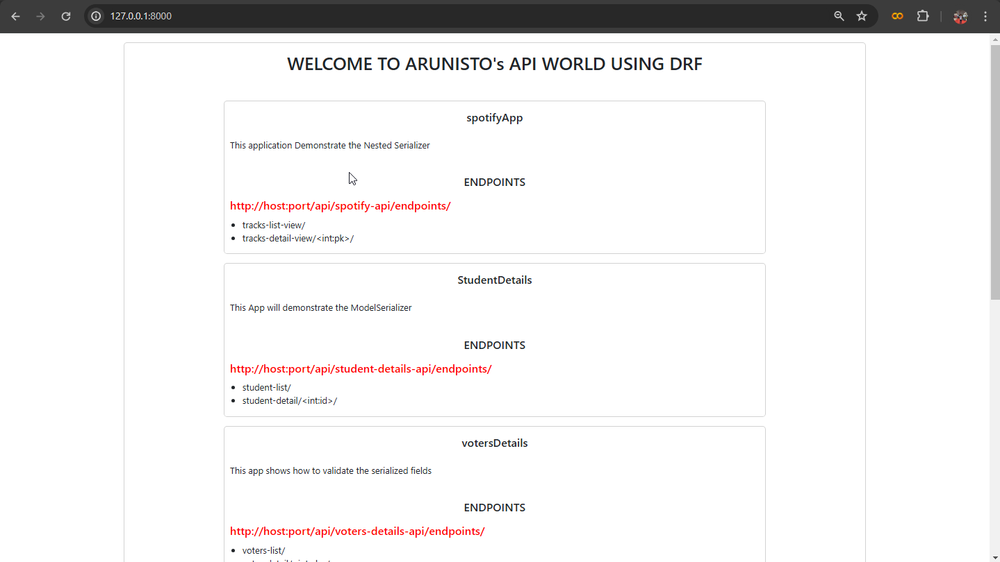
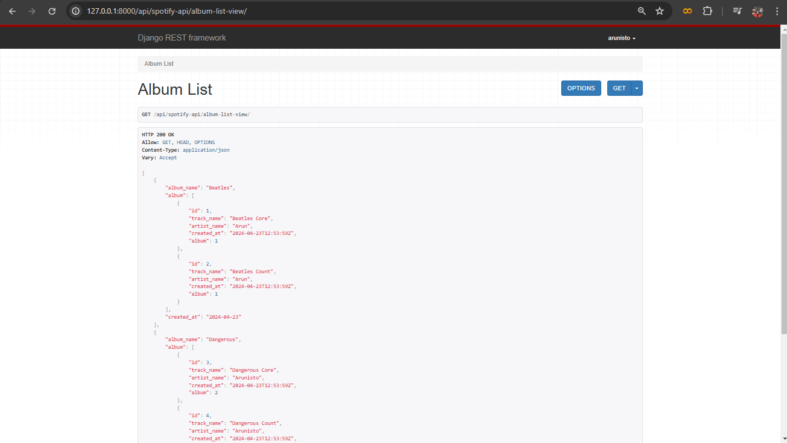

## 02.05.2024
Created a index page for `mainApp` to know about the api's that we built and their info and the endpoints details, so, if you run the project folder and navigate to the homepage you will see the page like below



## 03.05.2024
Again we're continuing with the `NestedSerializer` concept, so already we created an app to perform the nested serializer. So, the app contains two table already we created one table as an serialized object so today we're going to see how to do other
```python
from rest_framework import serializers
from .models import Album, Tracks

class TrackSerializer(serializers.ModelSerializer):
    class Meta:
        model = Tracks
        fields = "__all__"
```
So, this is the already existing code. Here, you can see that we already created for `Tracks` model. Next, we're going to create for the `Album` model like this.

```python
class AlbumSerializer(serializers.ModelSerializer):
    class Meta:
        model = Album
        exclude = ["id"]
```
In the above code we added our album serializer. And, I use `exclude` method to remove id from serialization after this we're going to add the views for album also like that we already done on our previous projects.

Data which belong to the foreign key should displayed this is why we use `Nested Serializer`. For this we need to add some code on our Serializer that we created for our album, Actually `album` is the foreign key of `tracks`. So, we're going to add some code on the album serializer like below.

```python
class AlbumSerializer(serializers.ModelSerializer):
    #nested serializer concept
    album_name = serializers.CharField() # <------
    album = TrackSerializer(many=True, read_only=True) # <-----
    class Meta:
        model = Album
        exclude = ["id",]
```
So, here we added two lines of code first one for our album_name, second one for album. And, always remember what you will use as a `related_name` in your foreign key model like my model below

```python
class Tracks(models.Model):
    track_name = models.CharField(max_length=50)
    artist_name = models.CharField(max_length=50)
    created_at = models.DateTimeField(default=datetime.datetime.now())
    album = models.ForeignKey(Album, on_delete=models.CASCADE, related_name="album")

    def __str__(self):
        return f"Track {self.track_name}"
```
on the above code you can see the `related_name` as `album`. After this change again restart your server and go to your endpoint. so, you can view the data that belongs to this foreign key. like below,



So, here we do it for the list-view, next we're going to do for the detail view for that we're going to create a new view for the `detail-view`.  No, need to worry actually this is also the same type of code that we used on our previous projects.
